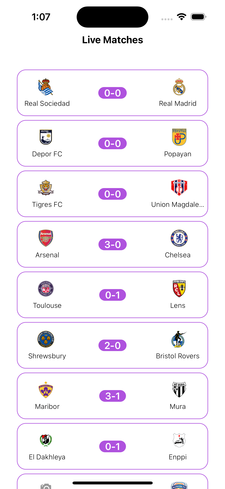

# football-discovery

## SwiftUI + Combine
- This project developed in SwiftUI along with MVVM + Combine
- Combine implemented in every layer data, domain and presentation

## Screenshots

## Future enhancements
- Input and output layer for viewmodel sperated out
- Live Player stats to be shown on lineup field
- Unit tests 
